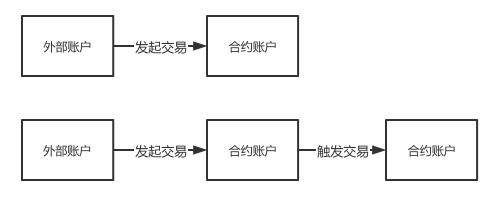
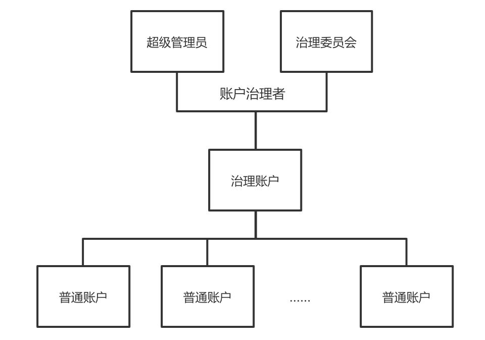
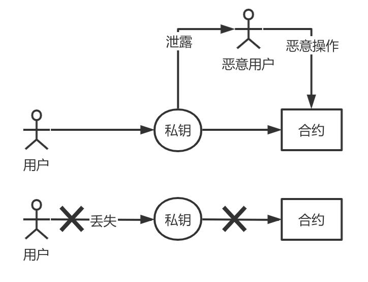
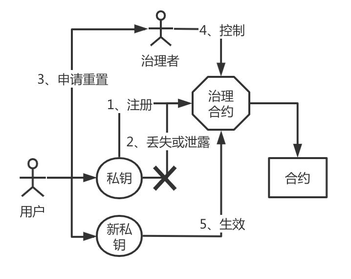
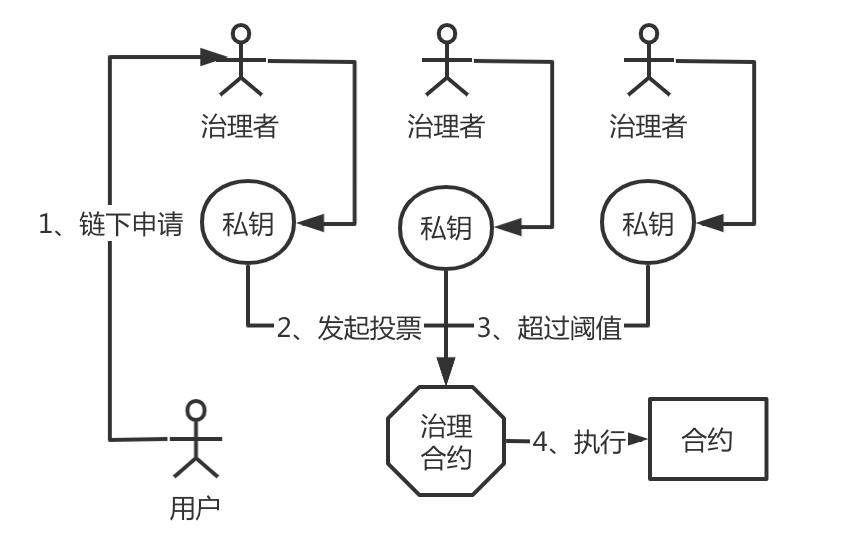
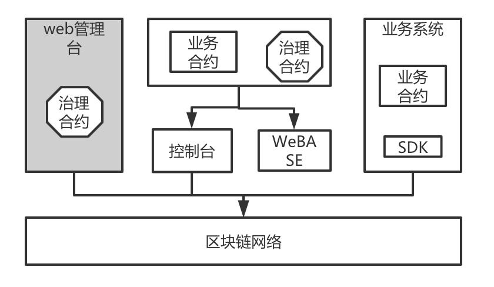

# 术语定义
## 区块链常用术语
- 外部账户(Externally account)，私钥控制，没有代码关联，可发起交易。外部账户的地址是由私钥所生成的。
- 合约账户(Contract account)，合约部署生成，与代码关联，不可发起交易只能被外部账户调用。合约账户的地址是在创建合约是确定的（一般通过计算合约创建者的地址和该地址发出过的交易数量得到）。



## 账户治理组件所引入的术语
- 治理账户(Governance account)，区块链链治理主体的管理账户。该账户本身为合约账户，其账户关联了合约治理相关的代码，绑定了一个或一组外部账户。只有被绑定的外部账户才能操作此治理账户。此外，只有状态正常的普通账户才能被设置为治理账户。
- 普通账户（Normal account），区块链链治理的对象。该账户本身为合约账户，该账户与一个外部账户一一映射并被绑定，关联了状态、配置和操作的代码。只有治理账户和被绑定的外部账户才能操作此治理账户。
- 账户治理者（Account Governance Administer），区块链账户治理者负责直接管理和操作治理账户，即所谓的『链管理员』。根据是否是由单一机构管理，又可以划分为带有传统中心化管理特征的超级管理员和去中心化多机构协作的账户治理委员会两类。治理者行使账户的管理职能，支持对普通账户重置私钥、冻结、解冻、销户等操作。
- 治理模式（Governance Mode），账户治理者所采用的账户治理的方式，主要有两种，分别为超级管理员模式和治理委员会模式（又被称为投票模式）。
- 超级管理员（Super Administer），在超级管理员治理模式下，治理账户由一个唯一的治理者来控制。
- 账户治理委员会（Account Governance Committee），通常是参与链的业务多方共同选出的一个委员会，共同参与账户治理。委员会成员拥有对账户治理事务的投票权，通过投票的方式，来决策和管理相关操作。
- 社交好友重置机制（Social Friends Reset Mechanism），是指用户为普通账户设置一组关联的其他普通账户的地址，这些普通账户一般是用户的社交好友们的普通账户。一旦用户需要重置私钥，可通过联系好友发起重置申请，经过多个社交好友同意后，可重置用户普通账户所绑定的私钥。

下图为账户治理各概念之间的联系：



# 背景
## 为什么需要引入账户治理？
在现有的区块链网络中，是以私钥为控制的中心进行设计的： 每个区块链的参与者首先创建一个私钥，通过这个私钥生成公钥并进一步生成外部账户；随后，参与者使用这个私钥对发起的交易报文进行签名并上链。参与者之间也可以通过外部账户的地址来识别和标识身份，完成相关的业务交互。可以说，这个私钥至关重要，一旦泄露或丢失，后果极为严重：
- 泄露以后，盗窃者可以任意控制该外部账户下所有的合约，发送任意的交易指令。
- 丢失以后，原有的用户会失去对该外部账户下所有的合约的控制，无法发送任何的交易指令。



在现有的业务场景中，欠缺对上述两种情况的有效应对和补救措施，只能寄希望于参与者自身能做好隐私保护和预防措施。

## 账户治理机制是如何解决上述痛点的？

为了解决此问题，需要引入一种账户治理的机制，将原有的账户控制以私钥为中心，改为以普通账户为中心。当用户发现泄露私钥后，可以自助发起重置普通账户所关联映射的私钥。当用户发现丢失私钥后，可以通过向账户治理委员会发起重置申请，更换私钥。而且，当用户更换私钥后，普通账户的地址始终不变，保证了业务平滑运行。



除了解决这个核心痛点外，账户治理体系还额外引入了注册、冻结、解冻、销户等概念，使得在一个分布式协作的业务模式中，账户相关的操作形成了闭环和自洽的治理逻辑。这样，当一个基于区块链的业务系统涉及到链上的账户体系时，可以快速借助账户治理组件的功能，快速、灵活得实现账户体系的治理。

## 治理者应该如何进行账户治理？
在传统的中心化的解决方案中，存在一个超级管理员的角色，典型的如传统关系型数据库中的root超级管理员，拥有所有的权限。为了兼容这种需求，我们提供了超级管理员的账户治理模式。

但是，传统的中心化解决方案中，存在着权限独大、已被操纵、不利制衡的缺陷，无法满足日益蓬勃的多机构分布式协作商业的发展。如果链的运营是由一组对等的机构采用分布式协作的方式来管理，则推荐采用治理委员会模式。

治理委员会模式下的治理者通常是参与链的多方共同选出的一个委员会，由多个机构共同进行管理和决策。治理账户维护了一组投票帐号和每个账户对应的投票权重，投票通过的阈值。当某个操作的投票数量超过阈值时，才允许执行该操作。无论是平权还是不同权重，借助这种灵活的投票机制，可以满足大部分复杂场景的治理需求。


# 概览
为了解决上述痛点，同时践行分布式商业的理念，acct-gov应运而生。

acct-gov是一套开源的区块链账户治理的中间件解决方案，提供了多种区块链账户治理模式、账户生命周期管理、用户自主管理区块链账户治理相关的整体解决方案，提供了包括治理账户创建、多种治理模式选择、治理权限授权，账户创建、冻结、解冻、更换私钥、销户等账户生命周期的各类账户管理功能。

## 关键特性

acct-gov定位为区块链账户治理中间件，旨在充分合理地在区块链节点网络中，利用智能合约所提供的图灵完备的计算能力，提供自洽的账户治理能力。

- **支持多种治理方式**
- **去中心化的分布式协作治理思想**
- **账户全生命周期的治理**
- **全面、灵活的集成方式**
- **支持可插拔的设计，对业务侵入小**
- **支持国密**
- **支持社交好友重置私钥**

## 组成部分
acct-gov包含了以下组成部分：
- **合约代码**，最核心的账户治理实现部分。当前版本提供了基于Solidity语言实现，完全适配FISCO BCOS。 理论上可在任何支持了EVM虚拟机的区块链系统上运行。
- **Java SDK**。适配了合约代码。通过集成Java SDK以后，可以适配和调用账户治理的所有合约接口。此外，进一步对使用接口进行简化和封装，可符合Java程序员的使用习惯。
- **合约集成Demo**。提供了基于存证和积分转账场景的两个demo。（详情可参考合约中samples目录）
- **SDK集成Demo**。以Weledger项目为例，展示了如何使用Java SDK。（详情可参考Weleder项目）
- **TDD测试代码**。包含了全套的合约测试代码，轻松支持CI/CD。(详情可参考Java SDK中src/test/java目录下的代码)
- _web管理台_  直接通过可视化页面来进行操作，正在开发中……



使用者基于自身业务的实际场景来自由、灵活地使用和集成。

## 集成方式

acct-gov提供了以下使用和集成的方式：
- 通过门面部署合约来发布合约到链上，获得账户治理的能力；
- 通过在自身业务的合约中引入或集成账户治理合约；
- 通过SDK引入Jar包，集成到自己的Java项目中来调用提供的接口；
- 通过部署acct-gov的服务，调用开放的Restful API接口。
- 通过web管理台来发布和执行账户管理功能（开发中……）


## 功能列表

### 治理者账户相关功能
- 重置用户私钥
- 冻结普通账户
- 解冻普通账户
- 注销普通账户
- 移交管理员权限（超级管理员模式下）
- 添加或修改一个治理委员会的投票账户（治理委员会模式下）
- 删除一个治理委员会的投票账户（治理委员会模式下）
- 设置投票阈值 （治理委员会模式下）

### 普通账户相关功能
- 创建一个新账户
- 重置用户私钥
- 注销账户
- 添加社交好友来支持重置账户私钥
- 添加或删除关联的社交好友
- 查询普通账户状态
- 查询外部账户是否已注册

更多详细的功能描述请参考《设计文档》。

## 业务流程介绍
1. 确定治理方式，确定是采用超级管理员模式还是治理委员会模式。所有的治理者需准备和生成机构的私钥。
2. 部署治理合约。根据步骤1确定的治理方式，发布对应的治理合约。
3. 用户普通账户开户。用户预先准备好自己的私钥，通过调用步骤2所部署的治理合约所生成的控制合约来开户。
4. 普通账户地址、状态查询。通过调用步骤2所部署的治理合约所生成的控制合约来查询用户地址和状态。
5. 账户治理常规操作。治理者可发起和操作普通账户。
6. 普通账户自助操作。普通账户可发起重置私钥，设置账户管理模式，添加关联社交好友普通账户等操作。
7. 普通账户销户。普通账户销户完成后，该账户生命周期终结。


# 快速开始
本章节以尽量短的时间，为使用者提供最简单的acct-gov的快速入门。

## 前置依赖
| 依赖软件 | 说明 |备注|
| --- | --- | --- |
| FISCO-BCOS | >= 2.0|
| Java | JDK[1.8] |请勿使用yum等工具安装的不完整的JDK版本|

 - Java版本
     JDK1.8 或者以上版本，推荐使用OracleJDK。  
     
     **注意**：CentOS的yum仓库的OpenJDK缺少JCE(Java Cryptography Extension)，会导致JavaSDK无法正常连接区块链节点。
    - Java安装
     参考 [Java环境配置](https://fisco-bcos-documentation.readthedocs.io/zh_CN/latest/docs/manual/console.html#java)
    - FISCO BCOS区块链环境搭建
     参考 [FISCO BCOS安装教程](https://fisco-bcos-documentation.readthedocs.io/zh_CN/latest/docs/installation.html)

 - 网络连通性
     检查Web3SDK连接的FISCO BCOS节点`channel_listen_port`是否能telnet通，若telnet不通，需要检查网络连通性和安全策略。

## 获取源码
由于暂未开源，暂时通过压缩包方式传递代码。压缩包中包含了智能合约代码，合约集成demo和Java SDK代码。
解压完成后，
- 所有智能合约文件位于src/main/contracts路径下
- 合约demo位于src/main/contracts/samples路径下
- 合约测试代码位于src/test/java路径下
- 其余部分代码为Java SDK代码。

## 使用组件合约
本章节介绍的是只使用合约本身的方式进行账户治理。如果需要使用SDK来治理的，可跳过本章节。

在完成FISCO BCOS链环境初始化以后，通过将acct-gov作为独立的插件，可使用控制台来部署账户治理的合约。可参考控制台的[安装与使用文档](https://fisco-bcos-documentation.readthedocs.io/zh_CN/latest/docs/manual/console.html)。

### 使用控制台部署和调用合约
本方式可直接通过控制台或WeBASE-Front来操作。

在此我们以控制台为例，进行演示，关于控制台的使用说明请参考[控制台的详细文档](https://fisco-bcos-documentation.readthedocs.io/zh_CN/latest/docs/manual/console.html)。

### 准备和登入控制台环境
在进入以下的操作前，首先我们进入控制台，准备至少四组操作私钥。
```
# ./get_account.sh
[INFO] Account Address   : 0x1c7560296c101171eb8015cdc6cfbda26c866189
[INFO] Private Key (pem) : accounts/0x1c7560296c101171eb8015cdc6cfbda26c866189.pem
[INFO] Public  Key (pem) : accounts/0x1c7560296c101171eb8015cdc6cfbda26c866189.public.pem
```
执行以上操作，会在控制台的accounts目录下生成对应的pem私钥文件。

连续执行四次后，查看accounts目录，会发现已得到了四组密钥文件。
```
ll accounts
total 32
-rw-r--r-- 1 root root 237 Jul  5 11:46 0x14b0b2e52a156fcd310acee0692501ca23bb8a3e.pem
-rw-r--r-- 1 root root 174 Jul  5 11:46 0x14b0b2e52a156fcd310acee0692501ca23bb8a3e.public.pem
-rw-r--r-- 1 root root 237 Jul  5 11:47 0x1c7560296c101171eb8015cdc6cfbda26c866189.pem
-rw-r--r-- 1 root root 174 Jul  5 11:47 0x1c7560296c101171eb8015cdc6cfbda26c866189.public.pem
-rw-r--r-- 1 root root 237 Jul  5 11:56 0x5b15b41277f4cacfdad39ba06a5dcc1295af0fd8.pem
-rw-r--r-- 1 root root 174 Jul  5 11:56 0x5b15b41277f4cacfdad39ba06a5dcc1295af0fd8.public.pem
-rw-r--r-- 1 root root 237 Jul  5 11:46 0x7abb8086fcffd0417d9a4c9b615426aca5e4182d.pem
-rw-r--r-- 1 root root 174 Jul  5 11:46 0x7abb8086fcffd0417d9a4c9b615426aca5e4182d.public.pem
```

由于每次生成的密钥都是随机的，故而密钥的地址都是不同的。

接下来，我们使用最上面的私钥作为操作地址，登入控制台：
```
./start.sh 1 -pem accounts/0x14b0b2e52a156fcd310acee0692501ca23bb8a3e.pem  #1为群组ID
=============================================================================================
Welcome to FISCO BCOS console(1.0.10)!
Type 'help' or 'h' for help. Type 'quit' or 'q' to quit console.
 ________ ______  ______   ______   ______       _______   ______   ______   ______
|        |      \/      \ /      \ /      \     |       \ /      \ /      \ /      \
| $$$$$$$$\$$$$$|  $$$$$$|  $$$$$$|  $$$$$$\    | $$$$$$$|  $$$$$$|  $$$$$$|  $$$$$$\
| $$__     | $$ | $$___\$| $$   \$| $$  | $$    | $$__/ $| $$   \$| $$  | $| $$___\$$
| $$  \    | $$  \$$    \| $$     | $$  | $$    | $$    $| $$     | $$  | $$\$$    \
| $$$$$    | $$  _\$$$$$$| $$   __| $$  | $$    | $$$$$$$| $$   __| $$  | $$_\$$$$$$\
| $$      _| $$_|  \__| $| $$__/  | $$__/ $$    | $$__/ $| $$__/  | $$__/ $|  \__| $$
| $$     |   $$ \\$$    $$\$$    $$\$$    $$    | $$    $$\$$    $$\$$    $$\$$    $$
 \$$      \$$$$$$ \$$$$$$  \$$$$$$  \$$$$$$      \$$$$$$$  \$$$$$$  \$$$$$$  \$$$$$$

=============================================================================================
[group:1]>
```

### 部署治理合约
为了便于部署acct-gov治理合约，我们共提供了三个facade合约，来便于快速部署，分别是：
1. AdminGovernFacade
2. VoteGovernFacade
3. WeightVoteGovernFacade

#### 超级管理员模式
```shell
deploy AdminGovernFacade
```

在控制台中，执行上述的命令，然后可以调用_governance函数来获得治理账户合约的地址，然后调用WEGovernnance合约的getAccountManager函数来获得账户管理合约的地址。

```shell
[group:1]> deploy AdminGovernFacade
contract address: 0x9012531f092c7ae47b048bd1fb576f0447ba9ed0

[group:1]> call AdminGovernFacade 0x9012531f092c7ae47b048bd1fb576f0447ba9ed0 _governance
0xbba738f0549cde5e5b0bab2dffc125501556018c

[group:1]> call WEGovernance 0xbba738f0549cde5e5b0bab2dffc125501556018c  getAccountManager
0xf0da09d98fe320371fe30d1bd035f0cabc305eaf
```
 
#### 治理委员会模式
需要输入部署的治理账户的外部账户地址列表和阈值。

```shell
deploy VoteGovernFacade(externalAccounts, threshold)
```

我们可以配置每个投票账户拥有相同的投票权重，这种投票方式也被称为多签制。
例如，我们部署三个地址，分别为三个不同的地址，三个账户的投票权限相同，阈值为2：

```shell
[group:1]> deploy VoteGovernFacade ["0x14b0b2e52a156fcd310acee0692501ca23bb8a3e","0x1c7560296c101171eb8015cdc6cfbda26c866189","0x5b15b41277f4cacfdad39ba06a5dcc1295af0fd8"] 2
contract address: 0xf794a0c54e8175fa0f5a607de0c3e56c98c8152f

[group:1]> call VoteGovernFacade 0xf794a0c54e8175fa0f5a607de0c3e56c98c8152f _governance
0x00461d25aaf57c968b2aa60f97b09001f5c3525f

[group:1]> call WEGovernance 0x00461d25aaf57c968b2aa60f97b09001f5c3525f getAccountManager
0xfcc0aecd2823f04b127a49bb84d12d7341161984
```

当然我们也可以配置每个投票的账户拥有不同的权重，这种投票方式也被称为权重制。
例如，我们部署三个地址，分别为三个不同的地址，对应的权重为1，2，3， 阈值为2：

```shell
[group:1]> deploy WeightVoteGovernFacade ["0x14b0b2e52a156fcd310acee0692501ca23bb8a3e","0x1c7560296c101171eb8015cdc6cfbda26c866189","0x5b15b41277f4cacfdad39ba06a5dcc1295af0fd8"] [1,2,3] 2
contract address: 0xe617e0bac8af46030a61795e6a3f5afe5a8cd08a

[group:1]> call WeightVoteGovernFacade 0xe617e0bac8af46030a61795e6a3f5afe5a8cd08a _governance
0x0d0b348afa14435b14e89333d9ca0e7e369c0aca

[group:1]> call WEGovernance 0x0d0b348afa14435b14e89333d9ca0e7e369c0aca getAccountManager
0xc5d8ee12b2fe8f632887efe22d9289ab6462074a
```

以上，我们已经成功部署了治理账户。注意，以上模式是任选其一的，一旦选择了其中的一种治理方式，后续无法再修改，请慎重选择。

### 操作治理合约
在部署了上述合约的前提下，可根据上一章节获得WEGovernance和AccountManager合约的地址。

#### 账户相关的常见操作
上述所有的Manager都继承了BasicManager基础Manager管理器，支持以下操作：
- newAccount 创建普通账户
- getAccount 查询普通账户地址
- hasAccount 查询普通账户是否已开户
- isExternalAccountNormal 查询外部账户状态是否正常

相关的使用实例如下。

创建一个普通账户
```
[group:1]>  call AccountManager 0xf0da09d98fe320371fe30d1bd035f0cabc305eaf newAccount "0x1c7560296c101171eb8015cdc6cfbda26c866189"
transaction hash: 0xeee7badb2ecdddd080aca04cda58498f27709efd0d1773fa770ed1c91f587119
---------------------------------------------------------------------------------------------
Output
function: newAccount(address)
return type: (bool, address)
return value: (true, 0x39be54ce16ccb720aa0ffedea27a7e3621565598)
---------------------------------------------------------------------------------------------
Event logs
event signature: LogSetOwner(address,address) index: 0
event value: (0x1c7560296c101171eb8015cdc6cfbda26c866189, 0x39be54ce16ccb720aa0ffedea27a7e3621565598)
event signature: LogManageNewAccount(address,address,address) index: 0
event value: (0x1c7560296c101171eb8015cdc6cfbda26c866189, 0x39be54ce16ccb720aa0ffedea27a7e3621565598, 0xf0da09d98fe320371fe30d1bd035f0cabc305eaf)
---------------------------------------------------------------------------------------------
```

查询普通账户地址
```
[group:1]> call AccountManager 0xf0da09d98fe320371fe30d1bd035f0cabc305eaf getAccount "0x1c7560296c101171eb8015cdc6cfbda26c866189"
0x39be54ce16ccb720aa0ffedea27a7e3621565598
```

查询普通账户是否已开户
```
[group:1]> call AccountManager 0xf0da09d98fe320371fe30d1bd035f0cabc305eaf hasAccount "0x1c7560296c101171eb8015cdc6cfbda26c866189"
true
```

查询外部账户状态是否正常
```
[group:1]> call AccountManager 0xf0da09d98fe320371fe30d1bd035f0cabc305eaf isExternalAccountNormal "0x1c7560296c101171eb8015cdc6cfbda26c866189"
true
```


#### 治理者的相关操作
治理者可分为超级管理员和治理委员会两种模式，其对应的治理操作也有所不同。

**在超级管理员模式下，包含了以下操作：**
获得Governance合约以后，可进行以下操作
- transferOwner 移交超级管理员账户
- setExternalAccount 重置用户私钥
- doOper 账户相关操作， 3-冻结账户 4-解冻账户 5-cancelAccount 注销账户

**移交超级管理员账户**

在控制台中进行操作。其中，被移交的账户已在上一章节中开户。
```
[group:1]> call WEGovernance 0xbba738f0549cde5e5b0bab2dffc125501556018c transferOwner "0x1c7560296c101171eb8015cdc6cfbda26c866189"
transaction hash: 0x849d1fadfd95be911b6c4cd3be52a3799b51aa9f8d71086039e7ce1b48513fb2
Event logs
event signature: LogSetOwner(address,address) index: 0
event value: (0x1c7560296c101171eb8015cdc6cfbda26c866189, 0xbba738f0549cde5e5b0bab2dffc125501556018c)
---------------------------------------------------------------------------------------------

```

**切换超级管理员登录**

可以看到该治理合约的权限已被移交到新的『0x1c7560296c101171eb8015cdc6cfbda26c866189』地址中。故我们需要退出并切换新的私钥来登录控制台。
```
[group:1]> exit
[root@instance-zw7wgjv0 console]# ./start.sh 1 -pem accounts/0x1c7560296c101171eb8015cdc6cfbda26c866189.pem
=============================================================================================
Welcome to FISCO BCOS console(1.0.10)!
Type 'help' or 'h' for help. Type 'quit' or 'q' to quit console.
 ________ ______  ______   ______   ______       _______   ______   ______   ______
|        |      \/      \ /      \ /      \     |       \ /      \ /      \ /      \
| $$$$$$$$\$$$$$|  $$$$$$|  $$$$$$|  $$$$$$\    | $$$$$$$|  $$$$$$|  $$$$$$|  $$$$$$\
| $$__     | $$ | $$___\$| $$   \$| $$  | $$    | $$__/ $| $$   \$| $$  | $| $$___\$$
| $$  \    | $$  \$$    \| $$     | $$  | $$    | $$    $| $$     | $$  | $$\$$    \
| $$$$$    | $$  _\$$$$$$| $$   __| $$  | $$    | $$$$$$$| $$   __| $$  | $$_\$$$$$$\
| $$      _| $$_|  \__| $| $$__/  | $$__/ $$    | $$__/ $| $$__/  | $$__/ $|  \__| $$
| $$     |   $$ \\$$    $$\$$    $$\$$    $$    | $$    $$\$$    $$\$$    $$\$$    $$
 \$$      \$$$$$$ \$$$$$$  \$$$$$$  \$$$$$$      \$$$$$$$  \$$$$$$  \$$$$$$  \$$$$$$

=============================================================================================
[group:1]>
```

**重置用户私钥**
```
[group:1]> call WEGovernance 0xbba738f0549cde5e5b0bab2dffc125501556018c setExternalAccount 2 "0x7abb8086fcffd0417d9a4c9b615426aca5e4182d" "0x14b0b2e52a156fcd310acee0692501ca23bb8a3e"
transaction hash: 0x8201112d9bce00d751e9f6fb13ef3182f4c0afafa750334a34820a5f5101fcc7
---------------------------------------------------------------------------------------------
Output
function: setExternalAccount(uint256,address,address)
return type: (bool)
return value: (true)
---------------------------------------------------------------------------------------------
Event logs
---------------------------------------------------------------------------------------------
```

**冻结、解冻与销户**
```
## 冻结
[group:1]> call WEGovernance 0xbba738f0549cde5e5b0bab2dffc125501556018c doOper 3 "0x7abb8086fcffd0417d9a4c9b615426aca5e4182d" 3
transaction hash: 0x645ccdb7569d53387ab28ede5b3b066971a87ff8ab45ab9ef663b5f4bfde3204
---------------------------------------------------------------------------------------------
Output
function: doOper(uint256,address,uint8)
return type: (bool)
return value: (true)
---------------------------------------------------------------------------------------------
Event logs
---------------------------------------------------------------------------------------------

## 解冻
[group:1]>  call WEGovernance 0xbba738f0549cde5e5b0bab2dffc125501556018c doOper 4 "0x7abb8086fcffd0417d9a4c9b615426aca5e4182d" 4
transaction hash: 0xe5ae51e446836abda81294175d508e0f938f12c53517673aabfa496d4f352b3c
---------------------------------------------------------------------------------------------
Output
function: doOper(uint256,address,uint8)
return type: (bool)
return value: (true)
---------------------------------------------------------------------------------------------
Event logs
---------------------------------------------------------------------------------------------

## 注销
[group:1]> call WEGovernance 0xbba738f0549cde5e5b0bab2dffc125501556018c doOper 5 "0x7abb8086fcffd0417d9a4c9b615426aca5e4182d" 5
transaction hash: 0xd13bfc5cd76fb38bea1d05de7b4bec8463ce86a69f4c6b2a3c66ed8bcce582a4
---------------------------------------------------------------------------------------------
Output
function: doOper(uint256,address,uint8)
return type: (bool)
return value: (true)
---------------------------------------------------------------------------------------------
Event logs
---------------------------------------------------------------------------------------------

```

**在治理委员会模式下，包含了以下操作**：
- register 申请发起治理操作，包括了： 10-申请重设治理委员会投票阈值， 11-申请重设治理委员会投票权重，2-申请重置账户，3-申请冻结账户，4-申请解冻账户， 5-申请注销账户
- vote 对申请项投票
- setExternalAccount 重置用户私钥
- doOper 投票通过后，发起治理操作，包括了冻结账户、解冻账户、注销账户等。
- setThreshold 设置投票的阈值。
- setWeight 设置投票者的权重。

详细的操作方式可参考治理合约的相关代码接口。

由于使用控制台操作治理委员会相关操作较为繁琐，我们推荐采用Java SDK的方式来进行。后期，我们会提供通过Web管理台的方式，敬请期待。


#### 普通用户的相关操作
普通用户可通过accountManager来重置和注销账户。
- resetAccount 重置用户私钥
- cancelAccount 注销账户

此外，支持用户自主设置账户治理模式，支持以下操作。
- setStatics 修改重置类型，0-不支持社交好友重置私钥，1-支持社交好友重置私钥
- setWeight 设置关联社交好友普通账户的权重
- register 发起投票
- vote 投票
- setExternalAccountBySocial 重置私钥

更多操作，请查看智能合约代码。由于直接操作合约的方式较为繁琐，此处不再进行详细地演示。**我们推荐使用Java SDK集成的方式来进行相关的操作。** 后续，我们将提供web管理台来便于用户使用，敬请期待。

### 将合约引入到用户自身的业务合约中
#### 组件合约引入
用户在具体的业务合约中，可采用引入的方式来使用acct-gov智能合约。

##### 在通用的场景中引入治理合约
```javascript
// 在业务合约中声明import账户管理合约。
import "./AccountManager.sol"

XXContract {
  // 创建AccountManager合约
  AccountManager _accountManager;
  
  construct(address accountManager) {
	    // 传入已部署的AccountManager地址。此地址由上面的部署治理合约步骤获得。
        _accountManager = AccountManager(accountManager);
  } 
  
    // ……
  function doSomeBiz() public {
        // 获得普通用户的地址
        address userAccountAddress = _accountManager.getAccount(msg.sender);
		// **特别注意**： 在具体的业务中，需使用此普通用户的地址来代替以往的外部地址。
        doBiz(userAccountAddress);
  }

}
```

##### 在涉及转账的场景中引入治理合约
在涉及到转账的场景中，引入合约的方式更为典型，本例来源于我们提供的使用demo，限于篇幅，此处略去了和示例非密切相关的部分，获取完整的demo代码可查找src/main/contracts/samples/TransferDemo/路径。

```javascript
import "./AccountManager.sol";
contract TransferDemo {
	// ……
    mapping(address => uint256) private _balances;
    // import AccountManager
    AccountManager _accountManager;

    constructor(address accountManager, uint256 initBalance) public {
        // 初始化accountManager，此地址由上面的部署治理合约步骤获得。
        _accountManager = AccountManager(accountManager);
		// 合约的owner设置为用户普通账户的地址
        address owner = _accountManager.getAccount(msg.sender);
        _balances[owner] = initBalance;
    }

    modifier validateAccount(address addr) {
        require(
            // 调用accountManager来判断该外部账户的地址是否已被注册及账户状态是否正常等。
            _accountManager.isExternalAccountNormal(addr),
            "Account is abnormal!"
        );
        _;
    }
   // ……
    function balance(address owner) public view returns (uint256) {
        // 1.先根据外部账户的地址查询普通账户的地址，然后仔查询余额
        return _balances[_accountManager.getAccount(owner)];
    }
    function transfer(address toAddress, uint256 value)
        public
        // 检查转入方和转出方的外部账户地址是否合法。
        validateAccount(msg.sender)
        validateAccount(toAddress)
        checkTargetAccount(toAddress)
        returns (bool)
    {
        // 1. 查询转出方的普通账户地址
        address fromAccount = _accountManager.getAccount(msg.sender);
        // 2. 查询转出方普通账户余额
        uint256 balanceOfFrom = _balances[fromAccount].sub(value);
        // 3. 转出方金额扣除
        _balances[fromAccount] = balanceOfFrom;
        // 4. 查询转入方的普通账户地址
        address toAccount = _accountManager.getAccount(toAddress);
        // 5. 转入方余额增加
        uint256 balanceOfTo = _balances[toAccount].add(value);
        // 设置转入方普通账户的余额
        _balances[toAccount] = balanceOfTo;
        return true;
    }
}
 
```


接下来，用户可到FISCO BCOS控制台中，将XXContract的业务合约编译为具体的Java代码。控制台提供一个专门的编译合约工具，方便开发者将Solidity合约文件编译为Java合约文件，具体使用方式参考[这里](https://fisco-bcos-documentation.readthedocs.io/zh_CN/latest/docs/manual/console.html#id10)

也可以通过控制台或WeBASE-Front等工具部署到链上，在此不再赘述。

更加完整地引入治理合约的例子和使用方式可以参考工程中附带的samples demo。我们提供了基于存证和积分转账场景的两个demo。


## 使用Java SDK
### 编译Jar包
由于本项目未正式发布，暂未发布Jar包到maven仓库，需要自己编译。也可以索取编译后的版本。
```shell
## ecdsa 版本
./gradlew clean ecdsa jar
## 国密版本
./gradlew clean gm jar
```

生成的Jar包位于： dist/acct-gov.jar

### 将Jar包引入到用户自己的Java业务项目中
引入刚才编译生成的账户治理的jar包到自己的Java项目中来使用。

以gradle构建为例，将该文件复制到自己项目libs的路径下，在自己项目的gradle中引入该jar包。

```groovy
dependencies {
    compile fileTree(dir: 'libs', includes: ['*.jar'])
}
```


### 调用SDK接口

#### 初始化factory

根据[web3j使用手册](https://fisco-bcos-documentation.readthedocs.io/zh_CN/latest/docs/sdk/java_sdk.html#id5)获取web3j、credentials和StaticGasProvider对象。

```java
AccountGovernManagerFactory factory = new AccountGovernManagerFactory(web3j, credentials, staticGasProvider);   
```

如果搭建的链为国密版本，需要传入国密参数。

```java
AccountGovernManagerFactory factory = new AccountGovernManagerFactory(web3j, credentials, 1, staticGasProvider);    //0-ecdsa,1-gm
```

如果已通过其他方式预先部署了治理合约，则可以传入治理合约的地址。
```java
AccountGovernManagerFactory factory = new AccountGovernManagerFactory(web3j, credentials, 0, staticGasProvider, governanceAddress);  
```

#### 获得部署治理合约管理器
如果治理合约已通过控制台等其他方式部署，可跳过此步。
```java
GovernAccountInitializer governAccountInitializer = factory.newGovernAccountInitializer();
```

获得此对象后，即可以创建治理合约。

1. 创建超级管理员模式的治理合约
```java
    WEGovernance govern = adminModeManager.createGovernAccount(credentials);
```

2. 创建平权投票模式的治理合约, 总共有三个投票者，投票阈值为2
```java
	List<String> list = new ArrayList<>();
    list.add(credentials1.getAddress());
    list.add(credentials1.getAddress());
    list.add(credentials1.getAddress());
    // 创建账户
    WEGovernance govern = adminModeManager.createGovernAccount(list, 2);
```

3. 创建不同权重投票模式的治理合约
```Java
	// 准备3个治理账户管理成员的公钥地址，生成治理账户
	List<String> list = new ArrayList<>();
    list.add(credentials1.getAddress());
    list.add(credentials1.getAddress());
    list.add(credentials1.getAddress());
    // 设置3个投票账户的权重分别为1、2、3
    List<BigInteger> weights = new ArrayList<>();
    weights.add(BigInteger.valueOf(1));
    weights.add(BigInteger.valueOf(2));
    weights.add(BigInteger.valueOf(3));
    // 创建账户
    WEGovernance govern = adminModeManager.createGovernAccount(list, weights, 4);
```


以上三种治理合约只需要任选一种模式创建即可，最后都可以获得治理账户WEGovernance对象。


#### 创建账户治理操作各类管理器

##### 创建治理者管理器
治理者管理器包含了所有治理者相关的操作。

###### 超级管理员模式

```Java
//超级管理员模式下
AdminModeGovernManager adminModeGovernManager = factory.newAdminModeGovernManager();
```

AdminModeGovernManager包含了以下操作：
- transferAdminAuth 移交超级管理员账户
- resetAccount 重置用户私钥
- freezeAccount 冻结账户
- unfreezeAccount 解冻账户
- cancelAccount 注销账户

###### 治理委员会模式

```Java
//治理委员会模式下
VoteModeGovernManager voteModeGovernManager = factory.newVoteModeGovernManager();
```

VoteModeGovernManager包含了以下操作：
- requestResetThreshold 申请重设治理委员会投票阈值
- requestRemoveGovernAccount 申请删除治理委员会成员账户
- requestAddGovernAccount 申请添加治理委员会成员账户
- requestResetAccount 申请重置账户
- requestFreezeAccount 申请冻结账户
- requestUnfreezeAccount 申请解冻账户
- requestCancelAccount 申请注销账户
- vote 对申请项投票
- resetAccount 重置用户私钥
- freezeAccount 冻结账户
- unfreezeAccount 解冻账户
- cancelAccount 注销账户
- resetThreshold 重设治理委员会投票阈值
- removeGovernAccount 删除治理委员会成员账户
- addGovernAccount 添加治理委员会成员账户

##### 创建普通账户管理器

普通账户管理器包含了所有普通账户的相关操作。
```Java
EndUserOperManager endUserOperManager = factory.newEndUserOperManager();
```

EndUserOperManager包含了以下操作：
- modifyManagerType 修改重置类型，0-不支持社交好友重置私钥，1-支持社交好友重置私钥
- setRelatedAccount 添加关联社交好友普通账户
- removeRelatedAccount 删除关联社交好友普通账户
- resetAccount 重置用户私钥
- cancelAccount 注销账户

##### 创建社交好友投票账户管理器
社交好友投票账户管理器包含了所有普通账户进行社交关系私钥重置的所有操作。
```Java
SocialVoteManager socialVoteManager = factory.newSocialVoteManager();
```

SocialVoteManager包含了以下操作：
- requestResetAccount 申请重置私钥
- vote 投票
- resetAccount 重置私钥


##### BasicManager公共操作
上述所有的Manager都继承了BasicManager基础Manager管理器，支持以下操作：
- createAccount 创建普通账户
- getUserAccount 查询普通账户地址
- getBaseAccountAddress 获得AccountManager合约控制器的地址
- hasAccount 查询普通账户是否已开户
- changeCredentials 切换操作者的私钥

更多操作，请查看《Java SDK 详细功能API使用说明》章节


# 组件使用demo
## 合约集成demo
### 存证demo
存证合约的demo请参考： src/main/contracts/samples/evidence/EvidenceDemo.sol
存证合约的demo在控制台的部署指令请参考： src/main/contracts/samples/evidence/console-demo.txt

### 转账demo
转账合约的demo请参考： src/main/contracts/samples/evidence/TransferDemo.sol
转账合约的demo在控制台的部署指令请参考： src/main/contracts/samples/evidence/console-demo.txt

## SDK集成Demo
Weledger项目完整集成了acct-gov的Java SDK，相关的用法详情可参考Weledger项目的文档和代码。

# 测试代码
## CI/CD测试代码
获取acct-gov工程代码。

### 链配置
打开src/main/application.properties，修改链配置信息。
```
## 机构ID
system.orgId=jigou
## 链的ip端口，多个节点使用;分隔
system.nodeStr=node1@[ip]:[channel_port]
## 群组ID
system.groupId=1
```

###自动运行
```
./gradlew test
```
可查看自动化测试的报告。


# Java SDK 详细功能API使用说明

## 治理账户功能使用说明
### 使用SDK部署合约
账户治理支持通过控制台或SDK来发布和部署合约，这里介绍如何通过SDK来部署。

#### 管理员模式

假如平台方采用管理员的治理模式，那么需要首先生成一个管理员的治理账户。

**具体调用示例：**

```javascript
    // 自动注入AdminModeGovernAccountInitializer对象
    @Autowired
    private GovernAccountInitializer governAccountInitializer;
    // 调用 createGovernAccount 方法生成管理员账户
    WEGovernance govern = adminModeManager.createGovernAccount(u);
```

**函数签名：**

```
WEGovernance createGovernAccount(Credentials credential)
```

**输入参数：**

- credential 管理员的私钥

**返回参数：**

- WEGovernance 返回的治理账户对象

调用成功后，函数会返回对应的WEGovernance治理账户对象，通过getContractAddress()方法可以获得对应的治理合约的地址。

#### 多签制治理模式

例如，以下平台方选择了治理委员会的治理模式，一共有三个参与者参与治理，治理的规则为任意的交易请求获得其中两方的同意，即可获得通过。那么我们接下来将创建一个治理账户。

**具体调用示例：**

```javascript
    // 自动注入GovernAccountInitializer对象
    @Autowired
    private GovernAccountInitializer governAccountInitializer;
    // 准备3个治理账户管理成员的公钥地址，生成治理账户
    List<String> list = new ArrayList<>();
    list.add(address1);
    list.add(address2);
    list.add(address3);
    // 创建账户
    WEGovernance govern = adminModeManager.createGovernAccount(list, 2);
```

**函数签名：**

```
WEGovernance createGovernAccount(List<Credentials> credentials, int threshold)
```

**输入参数：**

- externalAccountList  治理委员会成员的外部账户信息。
- threshold 投票阈值，如超过该投票阈值，表示投票通过。

**返回参数：**

- WEGovernance 返回的治理账户对象

调用成功后，函数会返回对应的WEGovernance治理账户对象，通过getContractAddress()方法可以获得对应的治理合约的地址。

#### 权重投票治理模式

本模式类似于上一种多签制，区别在于每个投票者的投票权重可以是不相同的。

例如，以下平台方选择了治理委员会的权重投票的治理模式，一共有三个参与者参与治理，投票的权重分别为1、2、3，阈值为4，也就是说任意的赞同选票权重相加超过阈值即可获得通过。那么我们接下来将创建一个治理账户。

**具体调用示例：**

```javascript
    // 自动注入GovernAccountInitializer对象
    @Autowired
    private GovernAccountInitializer governAccountInitializer;
    // 准备3个治理账户管理成员的公钥地址，生成治理账户
    List<String> list = new ArrayList<>();
    list.add(address1);
    list.add(address2);
    list.add(address3);
    // 设置3个投票账户的权重分别为1、2、3
    List<BigInteger> weights = new ArrayList<>();
    weights.add(BigInteger.valueOf(1));
    weights.add(BigInteger.valueOf(2));
    weights.add(BigInteger.valueOf(3));
    // 创建账户
    WEGovernance govern = adminModeManager.createGovernAccount(list, weights, 4);
```

**函数签名：**

```
WEGovernance createGovernAccount(List<String> credentialsList, List<BigInteger> weights, int threshold)
```

**输入参数：**

- externalAccountList  治理委员会成员的外部账户信息。
- weights  治理委员会成员对应的投票权重。
- threshold 投票阈值，如超过该投票阈值，表示投票通过。

**返回参数：**

- WEGovernance 返回的治理账户对象

调用成功后，函数会返回对应的WEGovernance治理账户对象，通过getContractAddress()方法可以获得对应的治理合约的地址。

### 管理员模式

管理员模式下的管理功能均位于GovernAccountInitializer类中。

首先，注入该类：

```javascript
@Autowired
private AdminModeGovernManager adminModeManager;
```

#### 重置用户私钥

**具体调用示例：**

```javascript
    TransactionReceipt tr = adminModeManager.resetAccount(u1Address, u2Address);
```

**函数签名：**

```
    TransactionReceipt resetAccount(String oldAccount, String newAccount)
```

**输入参数：**

- oldAccount  用户的外部账户的原私钥地址。
- newAccount  该账户被重置后的私钥地址。

**返回参数：**

- TransactionReceipt 交易回执

#### 冻结普通账户

**具体调用示例：**

```javascript
    TransactionReceipt tr = adminModeManager.freezeAccount(u1Address);
```

**函数签名：**

```
    TransactionReceipt freezeAccount(String account)
```

**输入参数：**

- account  用户的外部账户的私钥地址。

**返回参数：**

- TransactionReceipt 交易回执

#### 解冻普通账户

**具体调用示例：**

```javascript
    TransactionReceipt tr = adminModeManager.unfreezeAccount(u1Address);
```

**函数签名：**

```
    TransactionReceipt unfreezeAccount(String account)
```

**输入参数：**

- account  用户的外部账户的私钥地址。

**返回参数：**

- TransactionReceipt 交易回执

#### 账户强制注销

**具体调用示例：**

```javascript
    TransactionReceipt tr = governAccountInitializer.cancelAccount(u1Address);
```

**函数签名：**

```
    TransactionReceipt cancelAccount(String account)
```

**输入参数：**

- account  用户的外部账户的私钥地址。

**返回参数：**

- TransactionReceipt 交易回执

#### 移交管理员的权限
移交管理员账户时，需要确保被移交的账户已注册，且账户状态正常。

**具体调用示例：**

```javascript
    TransactionReceipt tr = adminModeManager.transferAdminAuth(u1Address);
```

**函数签名：**

```
    TransactionReceipt transferAdminAuth(String account)
```

**输入参数：**

- account  用户的外部账户的私钥地址。

**返回参数：**

- TransactionReceipt 交易回执

### 相同权重的投票制治理模式(多签制)

治理委员会模式下的管理功能均位于 VoteModeGovernManager 类中。

首先，注入该类：

```
@Autowired
private VoteModeGovernManager voteModeGovernManager;
```

在本模式下，执行任何账户相关的业务操作需要遵循以下步骤：

1. 发起一个投票请求；
1. 治理账户成员赞同该投票；
1. 投票发起者确认投票已经通过后，发起操作。

我们首先来介绍下通用的投票接口：

#### 治理委员会成员投票

**具体调用示例：**

```
    TransactionReceipt tr = voteModeGovernManager.vote(requestId, true);
```

**函数签名：**

```
    TransactionReceipt vote(BigInteger requestId, boolean agreed)
```

**输入参数：**

- requestId  发起投票的requestId。
- agreed 是否同意，true/false

**返回参数：**

- TransactionReceipt 交易回执

#### 重置用户私钥

参考上文提及的三个步骤：发起投票请求、投票、执行操作。此处，使用了单SDK来处理多用户的操作，使用了changeCredentials函数来切换不同的用户。

**具体调用示例：**

```javascript
    // 发起投票请求
    BigInteger requestId = voteModeGovernManager.requestResetAccount(p2.getAddress(), p1.getAddress());
    // 执行投票
    voteModeGovernManager.vote(requestId, true);
    // 切换投票者
    voteModeGovernManager.changeCredentials(u1);
    voteModeGovernManager.vote(requestId, true);
    // 切换投票者
    voteModeGovernManager.changeCredentials(u);
    // 发起重置私钥操作
    TransactionReceipt tr = voteModeGovernManager.resetAccount(requestId, p2.getAddress(), p1.getAddress());
```

##### 发起重置用户私钥投票申请

**函数签名：**

```
    BigInteger requestResetAccount(String newCredential, String oldCredential)
```

**输入参数：**

- oldCredential  用户的外部账户的原私钥地址。
- newCredential  该账户被重置后的私钥地址

**返回参数：**

- BigInteger 投票ID，用户需保存该ID便于后续的交互和其他操作。

##### 重置用户私钥

**函数签名：**

```
    TransactionReceipt resetAccount(BigInteger requestId, String newCredential, String oldCredential)
```

**输入参数：**

- requestId  之前的投票请求返回的ID
- newCredential  该账户被重置后的私钥地址
- oldCredential  用户的外部账户的原私钥地址。

**返回参数：**

- TransactionReceipt 交易回执。

#### 冻结普通账户

参考上文提及的三个步骤：发起投票请求、投票、执行操作。此处，使用了单SDK来处理多用户的操作，使用了changeCredentials函数来切换不同的用户。

**具体调用示例：**

```javascript
    // 发起投票请求
    BigInteger requestId = voteModeGovernManager.requestFreezeAccount(p2.getAddress());
    // 执行投票
    voteModeGovernManager.vote(requestId, true);
    // 切换投票者
    voteModeGovernManager.changeCredentials(u1);
    voteModeGovernManager.vote(requestId, true);
    // 切换投票者
    voteModeGovernManager.changeCredentials(u);
    // 发起重置私钥操作
    TransactionReceipt tr = voteModeGovernManager.freezeAccount(requestId, p2.getAddress());
```

##### 发起冻结用户账户投票申请

**函数签名：**

```
   BigInteger requestFreezeAccount(String credential)
```

**输入参数：**

- externalAccount  用户的外部账户地址。

**返回参数：**

- BigInteger 投票ID，用户需保存该ID便于后续的交互和其他操作。

##### 冻结用户账户

**函数签名：**

```
   TransactionReceipt freezeAccount(BigInteger requestId, String credential)
```

**输入参数：**

- requestId  之前的投票请求返回的ID
- externalAccount  用户的外部账户地址。

**返回参数：**

- TransactionReceipt 交易回执。

#### 解冻普通账户

参考上文提及的三个步骤：发起投票请求、投票、执行操作。此处，使用了单SDK来处理多用户的操作，使用了changeCredentials函数来切换不同的用户。

**具体调用示例：**

```javascript
    // 发起投票请求
    BigInteger requestId = voteModeGovernManager.requestUnreezeAccount(p2.getAddress());
    // 执行投票
    voteModeGovernManager.vote(requestId, true);
    // 切换投票者
    voteModeGovernManager.changeCredentials(u1);
    voteModeGovernManager.vote(requestId, true);
    // 切换投票者
    voteModeGovernManager.changeCredentials(u);
    // 发起重置私钥操作
    TransactionReceipt tr = voteModeGovernManager.unfreezeAccount(requestId, p2.getAddress());
```

##### 发起解冻用户账户投票申请

**函数签名：**

```
   BigInteger requestunfreezeAccount(String credential)
```

**输入参数：**

- externalAccount  用户的外部账户地址。

**返回参数：**

- BigInteger 投票ID，用户需保存该ID便于后续的交互和其他操作。

##### 解冻用户账户

**函数签名：**

```
   TransactionReceipt unfreezeAccount(BigInteger requestId, String credential)
```

**输入参数：**

- requestId  之前的投票请求返回的ID
- externalAccount  用户的外部账户地址。

**返回参数：**

- TransactionReceipt 交易回执。

#### 账户强制注销

参考上文提及的三个步骤：发起投票请求、投票、执行操作。此处，使用了单SDK来处理多用户的操作，使用了changeCredentials函数来切换不同的用户。

**具体调用示例：**

```javascript
    // 发起投票请求
    BigInteger requestId = voteModeGovernManager.requestCancelAccount(p2.getAddress());
    // 执行投票
    voteModeGovernManager.vote(requestId, true);
    // 切换投票者
    voteModeGovernManager.changeCredentials(u1);
    voteModeGovernManager.vote(requestId, true);
    // 切换投票者
    voteModeGovernManager.changeCredentials(u);
    // 发起重置私钥操作
    TransactionReceipt tr = voteModeGovernManager.cancelAccount(requestId, p2.getAddress());
```

##### 发起注销用户账户投票申请

**函数签名：**

```
   BigInteger requestCancelAccount(String credential)
```

**输入参数：**

- externalAccount  用户的外部账户地址。

**返回参数：**

- BigInteger 投票ID，用户需保存该ID便于后续的交互和其他操作。

##### 注销用户账户

**函数签名：**

```
   TransactionReceipt cancelAccount(BigInteger requestId, String credential)
```

**输入参数：**

- requestId  之前的投票请求返回的ID
- externalAccount  用户的外部账户地址。

**返回参数：**

- TransactionReceipt 交易回执。

#### 设置治理账户投票的阈值

参考上文提及的三个步骤：发起投票请求、投票、执行操作。此处，使用了单SDK来处理多用户的操作，使用了changeCredentials函数来切换不同的用户。

**具体调用示例：**

```javascript
    // 发起投票请求
    BigInteger requestId = voteModeGovernManager.requestResetThreshold(newThreshold);
    // 执行投票
    voteModeGovernManager.vote(requestId, true);
    // 切换投票者
    voteModeGovernManager.changeCredentials(u1);
    voteModeGovernManager.vote(requestId, true);
    // 切换投票者
    voteModeGovernManager.changeCredentials(u);
    // 发起重置私钥操作
    TransactionReceipt tr = voteModeGovernManager.resetThreshold(requestId, newThreshold);
```

##### 发起设置治理账户投票申请

**函数签名：**

```
    BigInteger requestRemoveGovernAccount(int newThreshold)
```

**输入参数：**

- newThreshold  新阈值。

**返回参数：**

- BigInteger 投票ID，用户需保存该ID便于后续的交互和其他操作。

##### 设置新阈值

**函数签名：**

```
   TransactionReceipt resetThreshold(BigInteger requestId, int threshold)
```

**输入参数：**

- requestId  之前的投票请求返回的ID
- newThreshold  新阈值。

**返回参数：**

- TransactionReceipt 交易回执。

#### 治理账户删除一个投票账户

参考上文提及的三个步骤：发起投票请求、投票、执行操作。此处，使用了单SDK来处理多用户的操作，使用了changeCredentials函数来切换不同的用户。

**具体调用示例：**

```javascript
    // 发起投票请求
    BigInteger requestId = voteModeGovernManager.requestRemoveGovernAccount(p2.getAddress());
    // 执行投票
    voteModeGovernManager.vote(requestId, true);
    // 切换投票者
    voteModeGovernManager.changeCredentials(u1);
    voteModeGovernManager.vote(requestId, true);
    // 切换投票者
    voteModeGovernManager.changeCredentials(u);
    // 发起重置私钥操作
    TransactionReceipt tr = voteModeGovernManager.removeGovernAccount(requestId, p2.getAddress());
```

##### 发起删除一个治理账户投票申请

**函数签名：**

```
   BigInteger requestRemoveGovernAccount(String credential)
```

**输入参数：**

- externalAccount  用户的外部账户地址。

**返回参数：**

- BigInteger 投票ID，用户需保存该ID便于后续的交互和其他操作。

##### 删除一个投票账户

**函数签名：**

```
   TransactionReceipt removeGovernAccount(BigInteger requestId, String credential)
```

**输入参数：**

- requestId  之前的投票请求返回的ID
- externalAccount  用户的外部账户地址。

**返回参数：**

- TransactionReceipt 交易回执。

#### 治理账户添加一个投票新账户

参考上文提及的三个步骤：发起投票请求、投票、执行操作。此处，使用了单SDK来处理多用户的操作，使用了changeCredentials函数来切换不同的用户。

**具体调用示例：**

```javascript
    // 发起投票请求
    BigInteger requestId = voteModeGovernManager.requestAddGovernAccount(p2.getAddress());
    // 执行投票
    voteModeGovernManager.vote(requestId, true);
    // 切换投票者
    voteModeGovernManager.changeCredentials(u1);
    voteModeGovernManager.vote(requestId, true);
    // 切换投票者
    voteModeGovernManager.changeCredentials(u);
    // 发起重置私钥操作
    TransactionReceipt tr = voteModeGovernManager.addGovernAccount(requestId, p2.getAddress());
```

##### 发起添加一个治理账户投票申请

**函数签名：**

```
   BigInteger requestAddGovernAccount(String credential)
```

**输入参数：**

- externalAccount  用户的外部账户地址。

**返回参数：**

- BigInteger 投票ID，用户需保存该ID便于后续的交互和其他操作。

##### 添加一个投票账户

**函数签名：**

```
   TransactionReceipt addGovernAccount(BigInteger requestId, String credential)
```

**输入参数：**

- requestId  之前的投票请求返回的ID
- externalAccount  用户的外部账户地址。

**返回参数：**

- TransactionReceipt 交易回执。

### 不同权重的投票制治理模式

不同权重的投票制模式总体和多签制非常类似，此处不再做过多的赘述，请参考上节。

#### 治理账户添加一个投票新账户

参考上文提及的三个步骤：发起投票请求、投票、执行操作。此处，使用了单SDK来处理多用户的操作，使用了changeCredentials函数来切换不同的用户。

**具体调用示例：**

```javascript
    // 发起投票请求
    BigInteger requestId = voteModeGovernManager.requestAddGovernAccount(p2.getAddress() , weight);
    // 执行投票
    voteModeGovernManager.vote(requestId, true);
    // 切换投票者
    voteModeGovernManager.changeCredentials(u1);
    voteModeGovernManager.vote(requestId, true);
    // 切换投票者
    voteModeGovernManager.changeCredentials(u);
    // 发起重置私钥操作
    TransactionReceipt tr = voteModeGovernManager.addGovernAccount(requestId, p2.getAddress(), weight);
```

##### 发起添加一个治理账户投票申请

**函数签名：**

```
   BigInteger requestAddGovernAccount(String credential, int weight)
```

**输入参数：**

- externalAccount  用户的外部账户地址。
- weight 新加入账户的权重

**返回参数：**

- BigInteger 投票ID，用户需保存该ID便于后续的交互和其他操作。

##### 添加一个投票账户

**函数签名：**

```
   TransactionReceipt addGovernAccount(BigInteger requestId, String credential, int weight)
```

**输入参数：**

- requestId  之前的投票请求返回的ID
- externalAccount  用户的外部账户地址。
- weight 新加入账户的权重

**返回参数：**

- TransactionReceipt 交易回执。

#### 其他交易

其余部分颇为相似，可参考基于相同权重的投票模式

## 普通账户管理模式功能说明

### 普通账户主要功能

普通账户的功能均位于EndUserOperManager类中。

首先，注入该类：

```
@Autowired
private EndUserOperManager endUserOperManager;
```

#### 创建新账户

**具体调用示例：**

```
    String account = endUserAdminManager.createAccount(p1Address);
```

**函数签名：**

```
    String createAccount(String who)
```

**输入参数：**

- externalAccount  待创建的账户的外部账户的私钥地址。

**返回参数：**

- String 新建的账户地址

#### 重置用户私钥

**具体调用示例：**

```
    TransactionReceipt tr = endUserAdminManager.resetAccount(p2Address);
```

**函数签名：**

```
    TransactionReceipt resetAccount(String newCredential)
```

**输入参数：**

- newCredential  待更换的私钥地址。

**返回参数：**

- TransactionReceipt 交易回执

#### 账户强制注销

**具体调用示例：**

```
    TransactionReceipt tr = endUserAdminManager.cancelAccount();
```

**函数签名：**

```
    TransactionReceipt cancelAccount()
```

**返回参数：**

- TransactionReceipt 交易回执


#### 修改普通账户的管理类型

**具体调用示例：**

```
    List<String> voters = Lists.newArrayList();
    voters.add(u.getAddress());
    voters.add(u1.getAddress());
    voters.add(u2.getAddress());
    TransactionReceipt tr = endUserAdminManager.modifyManagerType(voters);
```

**函数签名：**

```
    TransactionReceipt modifyManagerType(List<String> voters)
    //重载函数，设置为仅自己管理
    TransactionReceipt modifyManagerType()
```

**输入参数：**

- voters （可选） 当变更为支持社交好友投票时需要传入，且voters的大小必须为3。投票本身为2-3的规则。如果voters不传入，则默认不开启投票模式。

**返回参数：**

- TransactionReceipt 交易回执

#### 添加一个社交好友

**具体调用示例：**

```
    TransactionReceipt tr = endUserAdminManager.addRelatedAccount(userAddress);
```

**函数签名：**

```
    TransactionReceipt addRelatedAccount(String account)
```

**输入参数：**

- account  被添加好友的外部账户地址。

**返回参数：**

- TransactionReceipt 交易回执

#### 删除一个社交好友

**具体调用示例：**

```
    TransactionReceipt tr = endUserAdminManager.removeRelatedAccount(userAddress);
```

**函数签名：**

```
    TransactionReceipt removeRelatedAccount(String account)
```

**输入参数：**

- account  被删除好友的外部账户地址。

**返回参数：**

- TransactionReceipt 交易回执

### 使用社交好友投票重置私钥

#### 重置用户私钥

参考上文提及的三个步骤：发起投票请求、投票、执行操作。此处，使用了单SDK来处理多用户的操作，使用了changeCredentials函数来切换不同的用户。

社交好友投票相关的操作在 SocialVoteManager 类中。

**具体调用示例：**

```javascript
    // 发起投票请求
    TransactionReceipt t = socialVoteManager.requestResetAccount(u1.getAddress(), p1.getAddress());
    // 执行投票
    socialVoteManager.vote(requestId, true);
    // 切换投票者
    socialVoteManager.changeCredentials(u1);
    socialVoteManager.vote(requestId, true);
    // 切换投票者
    socialVoteManager.changeCredentials(u);
    // 发起重置私钥操作
    TransactionReceipt tr = socialVoteManager.resetAccount(u1.getAddress(), p1.getAddress());
```

##### 发起重置用户私钥投票申请

**函数签名：**

```
    TransactionReceipt requestResetAccount(String newCredential, String oldCredential)
```

**输入参数：**

- oldCredential  用户的外部账户的原私钥地址。
- newCredential  该账户被重置后的私钥地址

**返回参数：**

- TransactionReceipt 交易回执。

##### 投票

**函数签名：**

```
    TransactionReceipt vote(String oldCredential, boolean agreed)
```

**输入参数：**

- oldCredential  申请变更账户的外部账户地址。
- agreed  是否同意

**返回参数：**

- TransactionReceipt 交易回执。

##### 重置用户私钥

**函数签名：**

```
    TransactionReceipt resetAccount(String newCredential, String oldCredential)
```

**输入参数：**

- newCredential  该账户被重置后的私钥地址
- oldCredential  用户的外部账户的原私钥地址。

**返回参数：**

- TransactionReceipt 交易回执。

